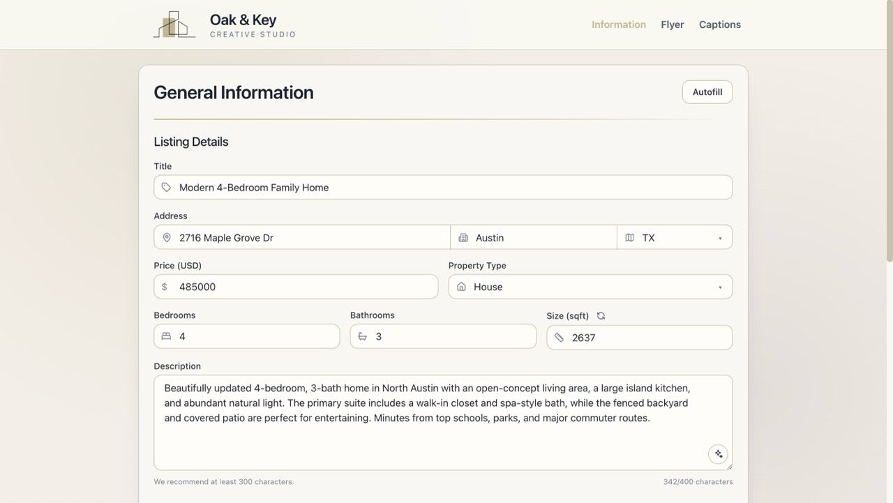
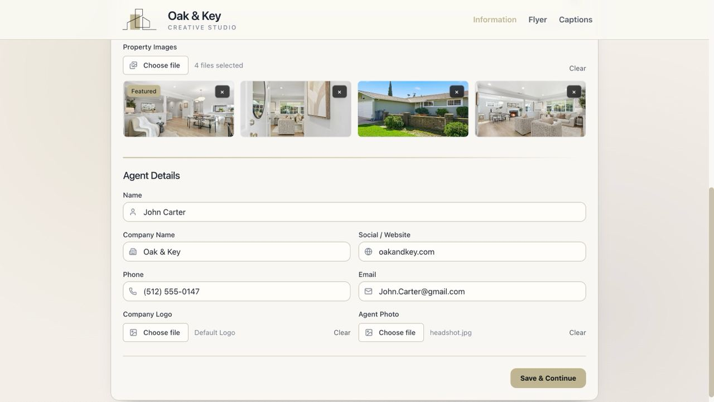
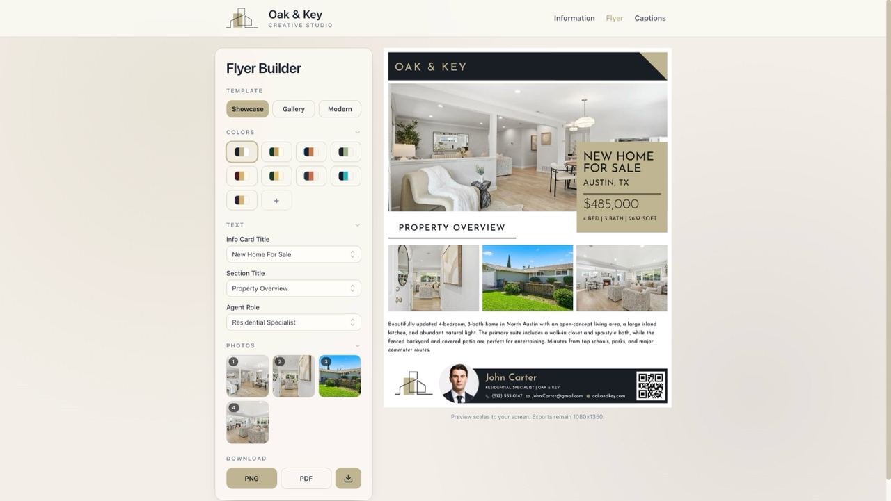
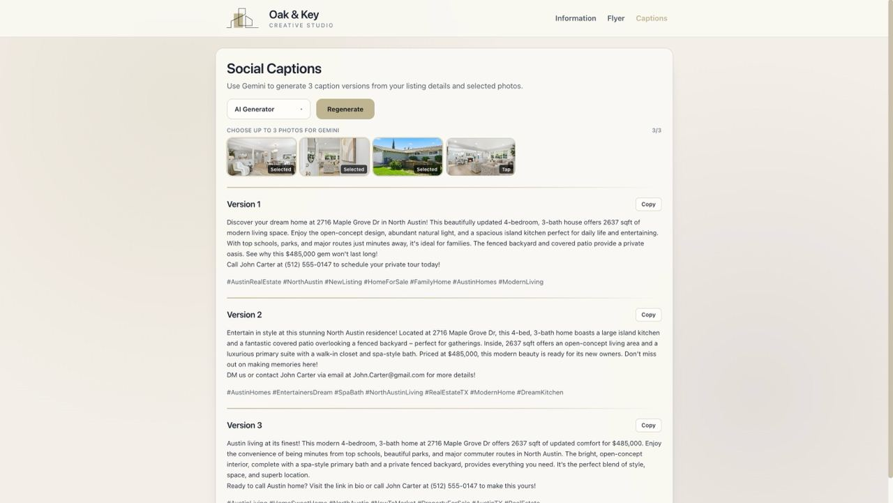

# 🏡 Oak & Key Creative Studio

Oak & Key Creative Studio is a real estate marketing platform that helps agents create professional marketing materials in minutes. Agents can enter listing information, upload property photos, and instantly generate branded flyers, social media captions, and polished property descriptions ready for clients and online marketing.

Built with **Next.js**, **React**, **Tailwind CSS**, **HTML**, **Gemini API**, and **Codex**, Oak & Key streamlines the marketing workflow for real estate professionals by reducing repetitive content creation and design work.


## 🚀 Live Demo

Check it out here: https://oak-and-key.vercel.app

## ✨ Features

- 🏠 Create and manage real estate listings with property and agent information
- 📸 Upload and reorder property photos for flyers and marketing materials
- ✍️ Rewrite and enhance property descriptions with Gemini AI
- 🎨 Customize flyers with multiple templates and color themes
- 🔗 Generate QR codes linking to property or agent websites
- 📄 Export flyers as high-resolution PNG or PDF files
- 📱 Responsive design optimized for desktop, tablet, and mobile devices
- 🤖 Generate social media captions using the Gemini API

## 📸 Screenshots

### Listing Information



### Agent Information



### Flyer Builder



### AI Caption Generation



### Showcase Template 


### Gallery Template 


### Modern Template 


## 💡 Why I Built This

Real estate agents spend significant time creating flyers, writing property descriptions, and producing social media content for every listing.

Oak & Key was built to streamline that process by providing a single platform where agents can:

- Enter listing information once
- Generate marketing materials automatically
- Create professional flyers
- Produce AI-generated social media content
- Export ready-to-share marketing assets

The goal was to reduce repetitive work and allow agents to spend more time serving clients instead of creating marketing content.

## 🛠 Tech Stack

### Frontend

- Next.js
- React
- Tailwind CSS
- HTML

### AI & APIs

- Gemini API
- Codex

### Export & Utilities

- html-to-image
- jsPDF

### State Management

- Zustand

## 🏗 Application Flow

1. Enter property information
2. Upload listing photos
3. Add agent branding details
4. Rewrite or enhance property descriptions
5. Build and customize a flyer
6. Export flyer as PNG or PDF
7. Generate AI-powered social media captions
8. Copy and publish marketing content

## 📁 Project Structure

```bash
app/
├── api/
│   ├── captions/
│   └── descriptions/
├── components/
│   └── PropertyNav.js
├── lib/
│   ├── captions/
│   ├── flyer/
│   ├── listing/
│   └── propertyStore.js
├── property/
│   ├── general/
│   ├── flyer/
│   ├── captions/
│   ├── constants/
│   └── components/
│       ├── captions/
│       ├── flyer/
│       ├── form/
│       └── shared/
├── page.js
└── layout.js
```

## ⚙️ Getting Started

### 1. Clone the Repository

```bash
git clone https://github.com/Sereyvidya/OakAndKey.git
cd OakAndKey/Client
```

### 2. Install Dependencies

```bash
npm install
```

### 3. Configure Environment Variables

Create a `.env.local` file in the Client directory:

```env
GEMINI_API_KEY=your_api_key_here
GEMINI_MODEL=your_gemini_model
```

### 4. Run the Development Server

```bash
npm run dev
```

Open:

```text
http://localhost:3000
```

## 🚧 Challenges & Technical Decisions

Some of the most interesting engineering challenges in this project included:

- Designing a shared property state that synchronizes information across the Information, Flyer, and Captions pages.
- Building reusable flyer templates capable of rendering different layouts while sharing the same listing data.
- Implementing image reordering and dynamically mapping selected photos into flyer layouts.

## 🎯 Future Enhancements

- User authentication
- Saved listings database
- Cloud image storage
- Additional flyer templates
- Team collaboration features
- CRM integrations
- Automated social media publishing
- Listing analytics dashboard

## 👨‍💻 Author

**Sereyvidya Vireak**

Computer Science graduate passionate about building practical software solutions that solve real-world problems.

GitHub: https://github.com/Sereyvidya

## 🪪 License

MIT License — free to use, modify, and build upon!